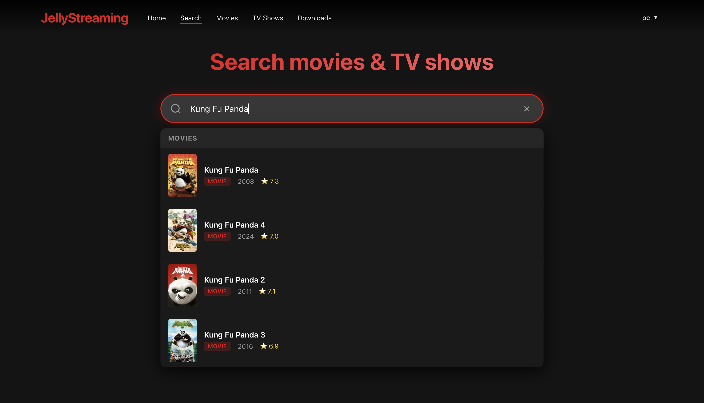
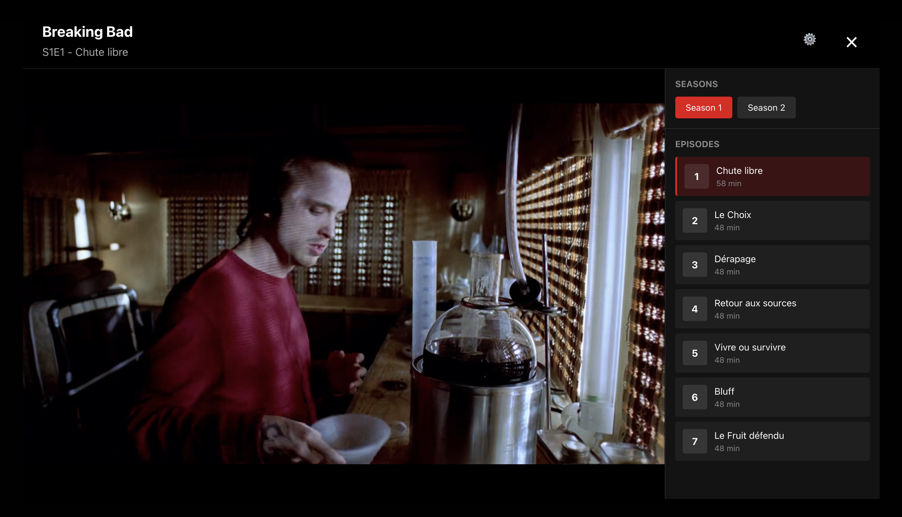

# JellyStreaming

A streaming media management system that connects to Jellyfin, Radarr, and Sonarr with a React frontend and a Go backend.

## Screenshots





## Features

### Core Features
- Browse your Jellyfin movie and TV show collection.
- Integrated HLS video player for streaming content from Jellyfin.
- Search and discover new content from TMDB.
- Add movies via Radarr and TV shows via Sonarr.

## Quick Start

### Prerequisites
- Docker.
- MongoDB database.
- Jellyfin, Radarr, and Sonarr instances.
- TMDB API key.

### Setup

1. **Clone the repository**
```bash
git clone https://github.com/enzodjabali/jellystreaming.git
cd jellystreaming
```

2. **Configure environment variables**
```bash
cp .env.example .env
# Edit .env with your actual credentials
```

3. **Start the application**
```bash
docker compose up --build
```

The application will be available at:
- Frontend: http://localhost:3000
- API: http://localhost:8080

4. **First login**
```
Username: admin
Password: admin
```

## Architecture

### Backend (Go)
- RESTful API with JWT authentication.
- MongoDB for user management.
- Proxies to Jellyfin, Radarr, Sonarr, and TMDB APIs.

### Frontend (React)
- Single Page Application (SPA).
- Context API for authentication state.
- Protected routes with role-based access.
- Responsive design.

### Database (MongoDB)
- User authentication and management.
- bcrypt password hashing.
